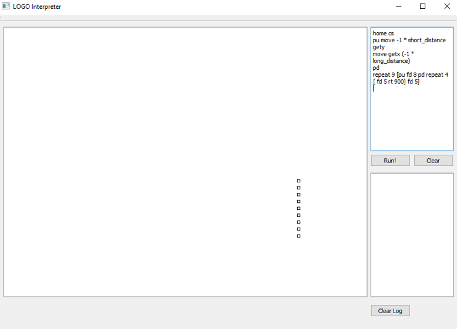
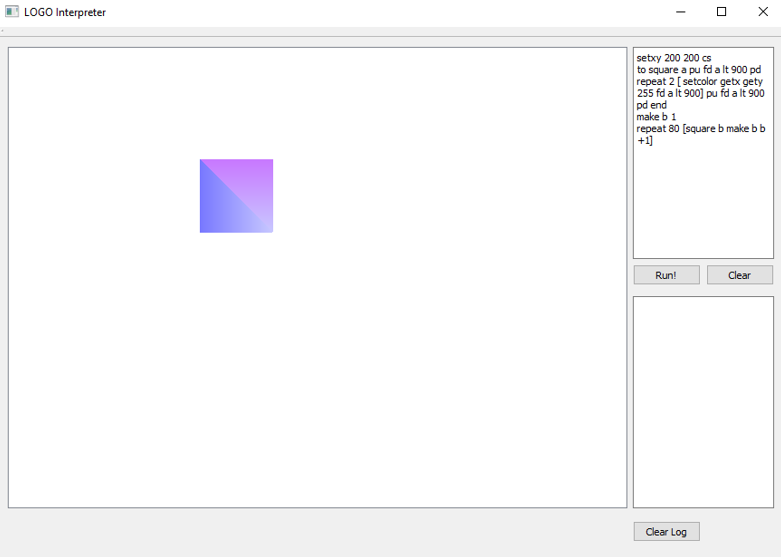

# Logo Interpreter

The program interpretes the basic LOGO language commands for drawing and moving the so called "turtle".

The user is able to:
* move the turtle forward or backward,
* turn the turtle right or left with an accuracy of 1/10 degree,
* move the turtle to absolute or relative coordinates,
* find the absolute position of the turtle,
* stop or resume drawing,
* change the color of a drawn line (RGB format),
* use arithmetic and logical expressions,
* use loops, conditional expressions and ***recursion***,
* perform any previously defined function,
* use predefined global or local variables of numeric type to perform functions and calculate expressions,
* write and load data,
* receive error messages.

The program is a window application, which works in interactive mode. 

## Grammar

```
non-zero-digit = "1" | "2" | "3" | "4" | "5" | "6" | "7" | "8" | "9" ;
zero = "0" ;
digit = non-zero-digit | zero ;
number = zero | non-zero-digit , { digit } ;
```

```
additive-operator = "+" | "-" ;
multiplicative-operator = "*" | "/" ;
bracket-open = "(" ;
bracket-close = ")" ;
```

```
additive expression = [ additive-operator ], multiplicative expression , 
[ additive operator , additive expression ] ;
```

```
bracket-expression = bracket open , additive expression , bracket close ;
```

```
multiplicative expression = ( number | variable | function | bracket expression ) , 
[ multiplicative operator , multiplicative expression ] ;
```

```
comparison operator = "<" | ">" | "=" | "!=" ;
unary-logical-operator = "not" ;
binary-logical-operator = "and" | "or" | "xor" ;
logical-braces-open = "{" ;
logical-braces-close = "}" ;
```

```
logical-expression-set = logical expression , [ binary logical operator , logical expression-set ] ;

logical-expression = additive expression , comparison operator , additive expression | 
unary logical operator , logical expression-set | bracket logical expression |
"true" | "false" | variable | function ;

bracket-logical-expression = logical-braces open , logical expression-set , logical-braces close ;
```
```
big-letter = "A" | "B" | "C" | "D" | "E" | "F" | "G" | "H" | "I" | "J" | "K" | "L" | "M" | 
"N" | "O" | "P" | "Q" | "R" | "S" | "T" | "U" | "V" | "W" | "X" | "Y" | "Z" ;
small-letter = "a" | "b" | "c" | "d" | "e" | "f" | "g" | "h" | "i" | "j" | "k" | "l" | "m" | 
"n" | "o" | "p" | "q" | "r" | "s" | "t" | "u" | "v" | "w" | "x" | "y" | "z" ;
letter = big letter | small letter ;
symbol = "`" | "~" | "!" | "@" | "#" | "$" | "%" | "^" | "&" | "*" | "(" | ")" | "-" | "_" | 
"=" | "+" | "[" | "]" | "{" | "}" | ";" | ":" | "'" | "," | "." | "<" | ">" | "/" | "?" | "\" | "|" ;
double-quote = '"' ;
bracket-statement-open = "["
bracket-statement-close = "]" 
character = letter | digit | symbol ;
string = double quote , { character | '\\"' } , double quote ;
identifier = letter , { letter | "_" | digit } ;
```

```
forward = "fd" , additive expression ;
backward = "bk" , additive expression ;
right = "rt" , additive expression ;
left = "lt" , additive expression ;
```

```
move-to-position = "setxy" , additive expression , additive expression ;
set-heading = "head" , additive expression ;
move-by-vector = "move" , additive expression , additive expression ;
turtle-go-home = "home" ;
```

```
get-position-x = "getx" ;
get-position-y = "gety" ;
get-heading = "getheading" ;
```

```
cleanscreen = "cs" ;
pen-up = "pu" ;
pen-down = "pd" ;
set-pen-color = "setcolor" , additive expression , additive expression, additive expression;
```

```
output-statement = "output" , additive expression ;
print-expression = "print" , ( additive expression | string ) ;
variable = identifier ;
scan-expression = "scan" , variable ;
local-variable-def = "local", ( "scan" , variable | "make" , variable , additive-expression );
variable-definition = "make" , variable , additive expression ;
```

```
if-statement = "if" , logical expression-set , bracket statement open , 
{ statement } , bracket statement close ;

repeat-statement = "repeat" , additive expression , bracket statement open , 
{ statement } , bracket statement close ;

function-definition = "to" , identifier , { identifier } , { statement } , "end" ;
function-call = identifier , { additive expression } | get position x | get position y | get heading ;
```

```
sleep-statement = "sleep" , additive-expression ;
```

```
statement = forward | backward | right | left | set position | set heading | move-to | turtle go home | 
cleanscreen | pen up | pen down | set pen color | output statement | print expression | scan expression | 
variable definition | if statement | function definition | function-call | sleep statement ;
```

```
starting-symbol = statement , { statement } ;
```

## Tokens

```
number = zero | non zero digit , { digit } ;
additive-operator = "+" | "-" ;
multiplicative-operator = "*" | "/" ;
bracket-open = "(" ;
bracket-close = ")" ;
comparison-operator = "<" | ">" | "=" | "!=" ;
logical-braces-open = "{" ;
logical-braces-close = "}" ;
string = double quote , { character | '\\"' } , double quote ;
identifier = letter , { letter | "_" | digit } ;
keyword = "fd" | "bk" | "rt" | "lt" | "move" | "head" | "home" | "getx" | "gety" | 
"getheading" | "cs" | "pu" | "pd" | "setcolor" | "output" | "print" | "scan" | 
"make" | "if" | "repeat" | "to" | "end" | "true" | "false" | 
"sleep" | "and | "or" | "not" | "xor" | "local" ;
bracket-statement-open = "["
bracket-statement-close = "]";
```

## Sample commands

* Moving the turtle forward by 100 
```
fd 100
```

* Moving the turtle forward by 100 with the usage of a variable
```
make long_distance 50
bk long_distance * 2
```


* Draw 9 small rectangles
```
home cs
pu move -1 * short_distance gety
move getx (-1 * long_distance) pd
repeat 9 [pu fd 8 pd repeat 4 [ fd 5 rt 900] fd 5]
```


* Draw a colorful rectangle
```
setxy 200 200 cs to square a pu fd a lt 900 pd 
repeat 2 [ setcolor getx gety 255 fd a lt 900] 
pu fd a lt 900 pd end make b 1 repeat 80 [square b make b b+1]
```
